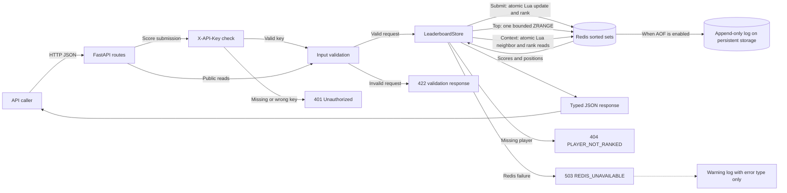

# Leaderboard architecture

The implemented service is one FastAPI application using Redis as its leaderboard source
of truth. Each game's sorted set stores one best score per player. Score submissions
require a trusted-server API key; reads remain public. Rate limiting, load balancing,
metrics export, replication, and failover are future work.

## Current request and data flow

The diagram shows the existing local service. HTTP uses Uvicorn locally; TLS termination
and a load balancer are not part of the current deployment. The API has storage-failure
warning logs and Uvicorn's standard access logs, not a metrics/observability pipeline.

## Data representation and ranking

A game uses the Redis key `<prefix>:game:<game_id>`, with default prefix `leaderboard`.
Sorted-set members are case-sensitive player IDs. Redis scores store the **negative**
of the player's public best score. For example, 100 points is stored as `-100`.

Ascending Redis order therefore produces public scores descending, then player IDs
ascending in ASCII order. Allowed IDs contain only ASCII letters, digits, `_`, and `-`.
Uppercase and lowercase IDs remain distinct. The fixed integer score range 0–1,000,000,000
is exactly representable in Redis's numeric scores.

**Shared rank = 1 + the number of players with a strictly higher public score.**
With negative storage scores, this is `1 + ZCOUNT(key, -inf, exclusive(stored_score))`.
A player also has a unique zero-based `ZRANK` position used only to find nearby players.
For scores `100, 100, 90`, displayed ranks are `1, 1, 3`; positions are `0, 1, 2`.

One key per game separates game data. It does not remove contention: this deployment's
Redis instance still processes operations for all games, and each atomic Lua script
blocks other commands for its duration.

## Request lifecycle

### Submit a score

`POST /games/{game_id}/scores` accepts a player ID and strict integer score. It requires
an `X-API-Key` header matching the configured submission key. After authentication and
input validation, one Redis script:

1. Uses `ZADD LT CH` with the negative score. New players are inserted; existing players
   change only when the new stored score is smaller, meaning the public score is higher.
2. Reads the resulting stored score with `ZSCORE`.
3. Counts strictly better scores to return the player's shared rank.

These steps run atomically. Concurrent submissions cannot replace a best score with a
lower score, and the returned score/rank refer to the same operation's state.
`updated` is true for insertion or an improvement, false for an equal/lower submission.
No score history is retained.

### Read top X

`GET /games/{game_id}/leaderboard?limit=10` performs one ascending `ZRANGE` with scores
for positions 0 through `limit - 1`. The default limit is 10; the maximum is 100.
Python assigns the first entry rank 1, retains rank for ties, and assigns each new score
group its first one-based display position. This works because the result is a complete
prefix of one Redis snapshot.

The limit counts players, so it may split a tied group. An empty game returns `200` and
an empty list. The API never loads the entire game merely to calculate a bounded top list.

### Read player context

`GET /games/{game_id}/players/{user_id}/context?radius=1` runs one Redis script:

1. Find the player's unique position with `ZRANK`; return a missing-player result if absent.
2. Read from `max(0, position - radius)` through `position + radius`, with scores.
3. Count strictly better scores across the **whole game's set** for each distinct score
   in the returned window, reusing counts for ties.

The script returns the player's index within that window and entries with global ranks.
Python separates the target from the `above` and `below` arrays. This remains correct when
the window starts halfway through a large tied group. The default radius is 1 and the
maximum is 10, bounding the script to at most 21 entries. Radius 0 returns the player alone.
All reads within the script describe one state, even while other clients submit scores.

Each request has its own consistent result. Two separate HTTP requests may legitimately
observe different ranks after an intervening update.

## Authentication boundary

`LEADERBOARD_SUBMISSION_API_KEY` is required at API startup, with no default or bypass.
It must contain 32–256 printable ASCII characters without whitespace; generate a random value and
keep it in the environment or ignored local `.env`. Compose requires and passes this
setting. POST score submissions require `X-API-Key`; missing or incorrect credentials
return `401` with `{"detail":"Invalid or missing API key"}` before storage is accessed.
All leaderboard/context GETs, health checks, documentation, and the OpenAPI schema remain
public. Swagger UI exposes the `ScoreSubmissionKey` authorization scheme.

The key authenticates a trusted submitting server, not an individual player. Any holder
can write scores for any game/player; per-game permissions and anti-cheat validation are
not implemented. Use HTTPS outside localhost, keep the key out of logs, and rotate it by
updating configuration and restarting the API and updating submitting clients.

## Errors and operational behavior

Validation rejects invalid IDs, scores, and query bounds before calling storage. Invalid
input returns `422` with JSON-safe validation details; raw input is not echoed. A missing
player returns `404 PLAYER_NOT_RANKED`. Redis failures in leaderboard operations return
`503 REDIS_UNAVAILABLE`, with a generic message and no connection credentials or traceback.

The application creates an asynchronous Redis client at startup and closes it during
shutdown. Connection and socket timeouts default to 2 seconds; both are configurable.
Automatic connection/timeout retries are disabled. These limits apply to individual
network operations, not the total HTTP request duration.

A timed-out write might already have executed. Retrying its best-score submission is safe;
a timeout must not be interpreted as proof that the score was unchanged.

`GET /health/live` reports that the API process responds. `GET /health/ready` pings Redis
and returns `503` with `{"detail":"Redis is unavailable"}` when that check fails.
Successful health responses include `status: "ok"` and the service name.

## Complexity and capacity

For N players in one game, X requested top players, and K context entries:

- Submission: O(log N), including the best-score update and shared-rank count.
- Top X: O(log N + X) in Redis and O(X) response processing in Python.
- Context: O(log N + K log N); counts are reused for equal scores and K is capped at 21.
- Storage: O(N) per game; all current leaderboard data must fit available Redis memory.

The API keeps no authoritative in-process leaderboard. Additional API instances could
share Redis, but they would not eliminate its capacity limit or single point of failure.
Sharding different games across Redis instances is a later option; splitting one very
large game makes exact global ranking substantially more complicated.

## Persistence and failure limits

Redis is the only current data store, not a disposable cache. Do not configure cache-style
eviction for authoritative scores. Configure memory limits deliberately, monitor capacity,
and arrange backups and recovery procedures before relying on the service operationally.

Compose enables Redis AOF and mounts `/data` on a named volume. The README's manual startup
command explicitly enables AOF with `appendfsync everysec` and stores data under
`.runtime/redis`. Manually starting Redis without those settings does not provide the
same persistence behavior. A volume alone does not enable Redis persistence.

With an every-second fsync policy, a crash can lose approximately the most recent second
of writes. A normal restart using the same data directory should retain recorded scores,
but a successful restart test does not establish crash durability. AOF and a local volume
also do not provide backups, replication, or protection from a lost host/volume.

## Verification and next steps

Tests use dedicated real Redis processes and isolated keys. They cover highest-score
updates, shared ranks, tie cutoffs, mid-tie context windows, boundaries, input validation,
game isolation, concurrent submissions, and safe failure responses. Resilience checks
exercise actual outages/timeouts, recovery, and normal restart with AOF enabled.

The current implementation still needs operational deployment verification. Prioritize
an accurate GitHub submission and a passing CI run. Further production work includes
rate limits, TLS, backups, memory monitoring, metrics, per-game submission permissions,
and an explicit replication/failover policy. The submission API key does not validate
whether a player earned a score; anti-cheat validation belongs in trusted game logic.
